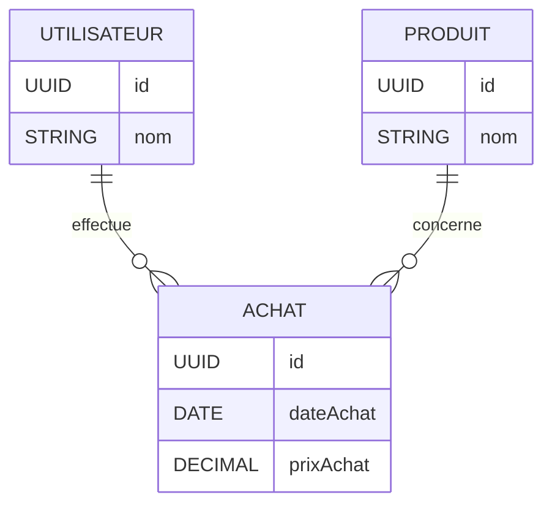

# Application de Suivi de Courses - User Stories et Critères d'Acceptation

## Vue d'ensemble
Application permettant de suivre, analyser et gérer les achats et dépenses liées aux courses.

---

## US-001 : Ajout d'achat de produits

### Description
En tant qu'utilisateur, je souhaite ajouter un nouvel achat de produit avec ses détails afin de suivre mes courses.

### Estimation (Story Points)
- 5

### Critères d'acceptation

#### AC1 : Cas favorable — Ajout d'achat
- Lorsque je clique sur "Ajouter un achat", un formulaire s'affiche avec les champs nom du produit, prix d'achat et date d'achat.
- Si tous les champs sont correctement remplis et validés, l'achat est enregistré et un message de confirmation s'affiche.
- Après enregistrement, le formulaire s'affiche vide et prêt pour un nouvel achat.

#### AC2 : Cas défavorable — Ajout d'achat
- Si un champ obligatoire est vide au moment de la validation, l'achat n'est pas enregistré et un message d'erreur indique les champs manquants.

---

## US-002 : Affichage de l'historique des courses

### Description
En tant qu'utilisateur, je souhaite consulter l'historique de mes courses triées par date afin de voir mes achats antérieurs.

### Estimation (Story Points)
- 3

### Critères d'acceptation

#### AC1 : Cas favorable — Historique
- La liste de tous les achats est accessible depuis l'onglet "Historique".
- Les achats sont triés par date décroissante (du plus récent au plus ancien).
- Chaque achat affiche le nom du produit, le prix d'achat et la date d'achat.
- Si la liste est longue, une pagination ou un scroll infini est disponible.

#### AC2 : Cas défavorable — Historique
- Si aucun achat n'est enregistré, un message "Aucun achat enregistré" s'affiche.

---

## US-003 : Analyse du top produit

### Description
En tant qu'utilisateur, je souhaite connaître le produit le plus acheté sur une période afin d'analyser mes habitudes d'achat.

### Estimation (Story Points)
- 8

### Critères d'acceptation

#### AC1 : Cas favorable — Analyse top produit
- La page "Analyse" ou "Top Produit" est accessible depuis la page d'accueil.
- L'utilisateur peut choisir une période prédéfinie (7 jours, 30 jours, 3 mois) ou une période personnalisée (date début/fin).
- Le nom du produit le plus acheté et le nombre d'occurrences sont affichés pour la période sélectionnée.
- Le top produit est déterminé uniquement par le nombre d'occurrences.
- En cas d'égalité, le produit acheté le plus récemment est affiché en priorité.

#### AC2 : Cas défavorable — Analyse top produit
- Si aucun achat n'existe sur la période sélectionnée, un message "Aucun achat dans cette période" s'affiche.

---

## US-004 : Bilan financier des dépenses

### Description
En tant qu'utilisateur, je souhaite connaître le montant total de mes dépenses afin de gérer mon budget.

### Estimation (Story Points)
- 5

### Critères d'acceptation

#### AC1 : Cas favorable — Bilan financier
- La page "Bilan Financier" est accessible depuis la page d'accueil.
- Le montant total des dépenses est affiché de façon visible et formaté avec 2 décimales.
- L'utilisateur peut filtrer les dépenses par période (semaine, mois ou période personnalisée).
- Le total correspond à la somme des prix d'achat.
- Après l'ajout d'un nouvel achat, le montant total se met à jour automatiquement.

#### AC2 : Cas défavorable — Bilan financier
- Si aucun achat n'est enregistré, le montant total affiché est "0,00".

---

## Notes supplémentaires

### Priorités suggérées
1. **Haute** : US-001 (Ajout d'achat) - Fonctionnalité essentielle
2. **Haute** : US-002 (Historique) - Requête pour consulter les données
3. **Moyenne** : US-004 (Bilan financier) - Utile pour la gestion budgétaire
4. **Moyenne** : US-003 (Top produit) - Analyse et insights

### Hypothèses
- L'application fonctionne sur navigateur web ou application mobile
- Les données sont sauvegardées en local ou sur un serveur backend
- Aucune authentification utilisateur requise pour cette version

### Dépendances
- US-001 doit être terminée avant US-002, US-003 et US-004
- US-002 et US-004 peuvent être développées en parallèle après US-001

---

## Diagramme MCD (Mermaid)


```

---

## Diagramme de cas d'utilisation (Mermaid)

```mermaid
---
title: Diagramme de Cas d'Utilisation - Application de Courses
---
usecaseDiagram

actor Utilisateur

rectangle "Application de Courses" {
  (Ajouter un achat)
  (Consulter l'historique)
  (Voir le Top Produit)
  (Voir le Bilan Financier)
}

Utilisateur --> (Ajouter un achat)
Utilisateur --> (Consulter l'historique)
Utilisateur --> (Voir le Top Produit)
Utilisateur --> (Voir le Bilan Financier)

(Ajouter un achat) ..> (Voir le Bilan Financier) : <<include>>
```
